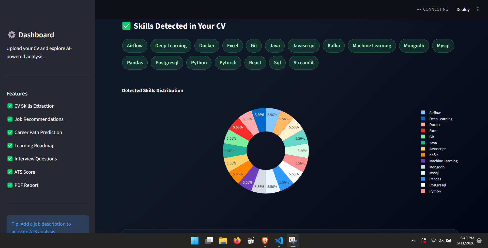
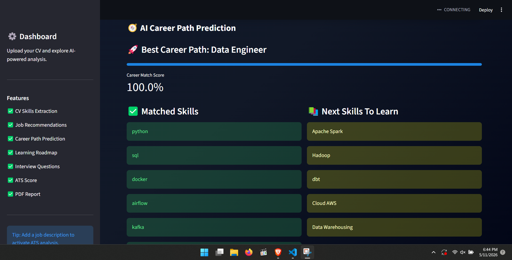
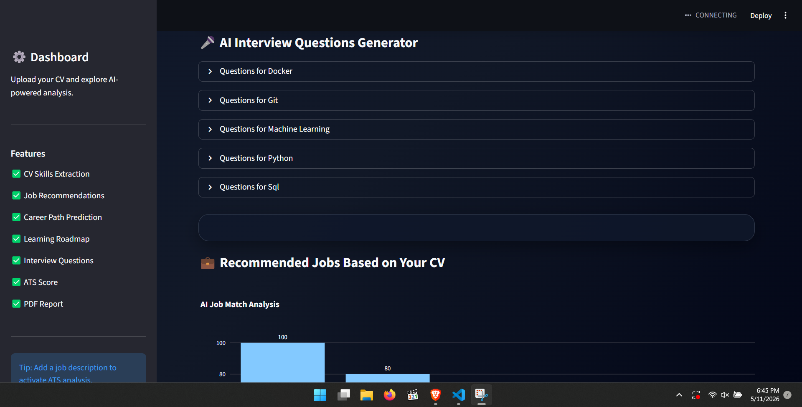
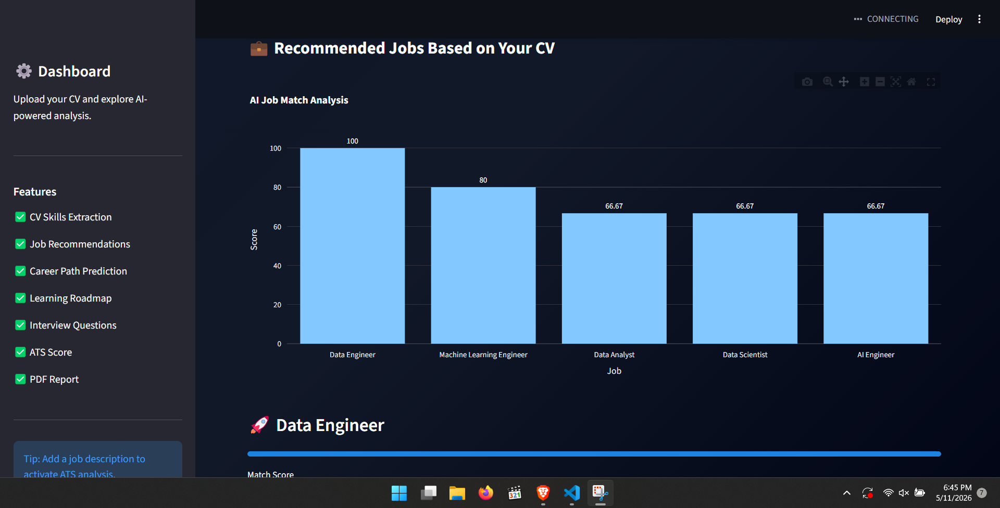
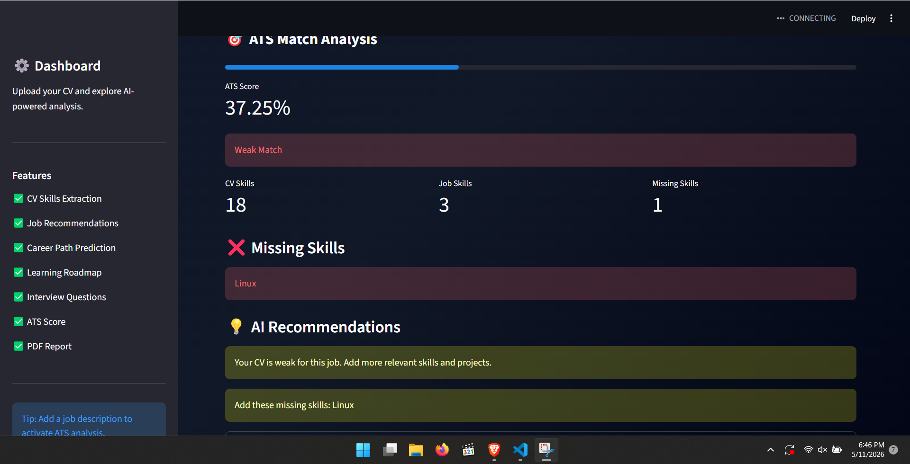

<<<<<<< HEAD
# 🤖 AI CV Analyzer

AI-powered CV Analyzer built with Python and Streamlit.

## 🚀 Features

- CV PDF Analysis
- Skills Extraction
- AI Job Recommendations
- Career Path Prediction
- Learning Roadmap Generator
- AI Interview Questions
- ATS Match Analysis
- Professional PDF Report
- Interactive Charts & Dashboard

## 🛠️ Technologies

- Python
- Streamlit
- Plotly
- Pandas
- NLP
- Sentence Transformers
- Scikit-learn
- FPDF

## 📦 Installation

```bash
git clone https://github.com/YOUR_USERNAME/ai-cv-analyzer.git

cd ai-cv-analyzer

python -m venv venv

venv\Scripts\activate

pip install -r requirements.txt

streamlit run app/main.py
=======
# ai-cv-analyzer
>>>>>>> ffd5e1f1dd45d7b52cce5a861f10f07662bc2c6c

```md
# 📸 Screenshots

## 🏠 Dashboard


---

## 📊 Skills Analysis



---

## 🧭 Career Path Prediction



---

## 🗺️ Learning Roadmap


---

## 🎤 Interview Questions



---

## 💼 Job Recommendations



---

## 🎯 ATS Analysis


```
